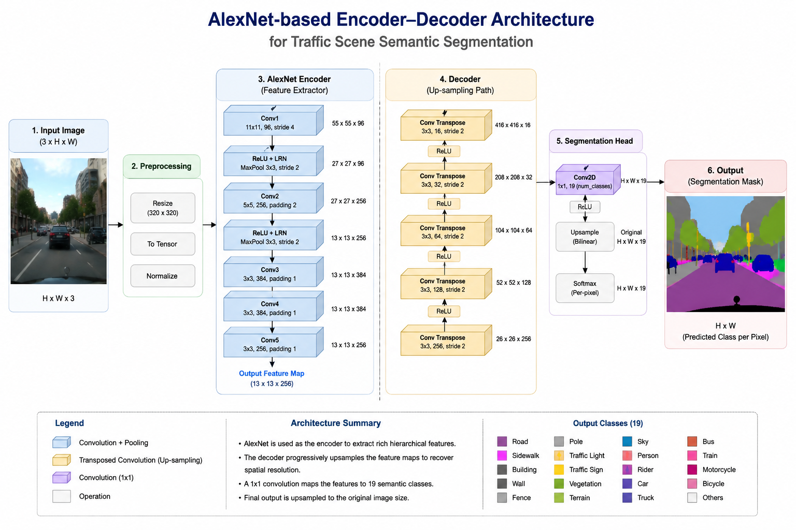
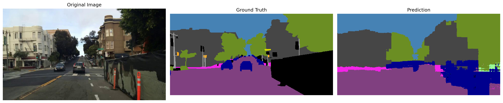
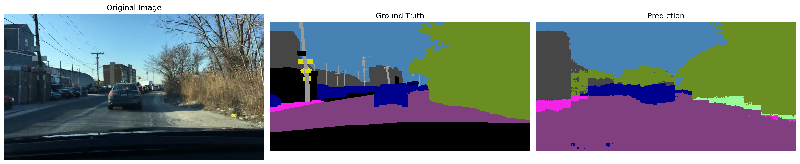
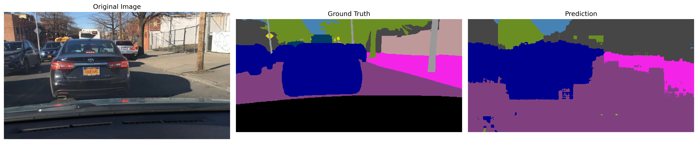
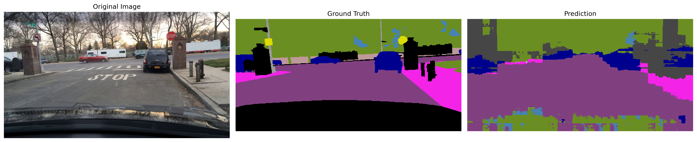
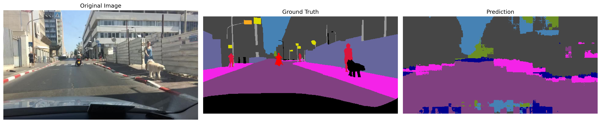
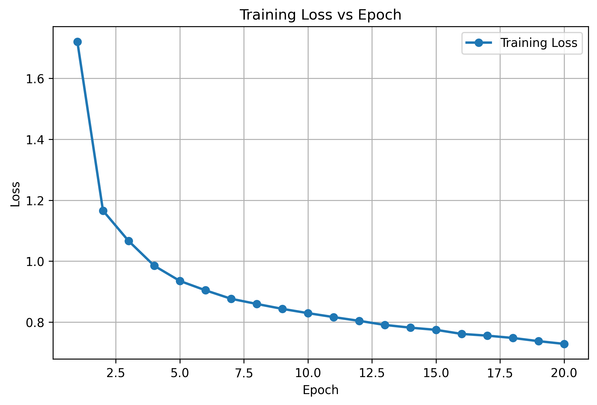

# 🚗 Traffic Scene Semantic Segmentation using a Custom AlexNet-based Encoder–Decoder Architecture

## 📌 Project Overview

This project implements a **Semantic Segmentation** model using a custom **AlexNet-based Encoder–Decoder Architecture** in PyTorch. The model is trained on the **BDD100K** dataset to perform pixel-wise classification of traffic scene images.

Unlike image classification, semantic segmentation predicts a class label for **every pixel** in an image. The model identifies different objects such as roads, vehicles, buildings, vegetation, sky, pedestrians, traffic signs, and other traffic scene elements.

The objective of this project is to understand and implement the complete semantic segmentation pipeline, including dataset preprocessing, model development, training, evaluation, visualization, and performance analysis.

---

# ✨ Features

- Custom AlexNet Encoder
- Custom Decoder for Semantic Segmentation
- Pixel-wise Image Segmentation
- BDD100K Dataset Support
- Custom Dataset and DataLoader
- Training Pipeline
- Evaluation Pipeline
- Visualization of Predictions
- Color Segmentation Masks
- Pixel Accuracy Evaluation
- Mean Intersection over Union (mIoU)
- Training Loss Visualization

---

# 🗂 Dataset

**Dataset Name:** BDD100K (Berkeley DeepDrive)

BDD100K is a large-scale autonomous driving dataset containing real-world road scenes with pixel-level semantic segmentation annotations.

### Classes

The model predicts **19 semantic classes**, including:

- Road
- Sidewalk
- Building
- Wall
- Fence
- Pole
- Traffic Light
- Traffic Sign
- Vegetation
- Terrain
- Sky
- Person
- Rider
- Car
- Truck
- Bus
- Train
- Motorcycle
- Bicycle

---


# 🏗 Model Architecture

The semantic segmentation model uses a custom AlexNet-based Encoder–Decoder architecture.



# 📂 Project Structure

```
Traffic-Segmentation-AlexNet/

│
├── models/
│   ├── encoder.py
│   ├── decoder.py
│   └── segmentation_model.py
│
├── preprocessing/
│   ├── dataset.py
│   ├── dataloader.py
│   └── transforms.py
│
├── outputs/
│   ├── predictions/
│   ├── plots/
│   └── metrics.txt
│
├── config.py
├── train.py
├── test.py
├── evaluate.py
├── metrics.py
├── visualize.py
├── plot_loss.py
├── utils.py
├── requirements.txt
└── README.md
```

---

# ⚙ Training Configuration

| Parameter | Value |
|-----------|--------|
| Framework | PyTorch |
| Dataset | BDD100K |
| Epochs | 20 |
| Batch Size | 4 |
| Optimizer | Adam |
| Loss Function | CrossEntropyLoss |
| Device | CPU |

---

# 📊 Final Results

| Metric | Value |
|---------|--------|
| Validation Loss | **0.7282** |
| Pixel Accuracy | **77.90%** |
| Mean IoU (mIoU) | **0.2564** |

---

# 🖼 Sample Prediction

### Example 1


### Example 2



### Example 3


### Example 4



### Example 5



# 🚀 Installation

Clone the repository

```bash
git clone https://github.com/Sandeepkumarreddy-7/Traffic-Segmentation-AlexNet.git
```

Move into the project

```bash
cd Traffic-Segmentation-AlexNet
```

Create Virtual Environment

```bash
python -m venv venv
```

Activate Virtual Environment

Linux

```bash
source venv/bin/activate
```

Windows

```bash
venv\Scripts\activate
```

Install Dependencies

```bash
pip install -r requirements.txt
```

---

# ▶ Training

```bash
python train.py
```

---

# 📈 Evaluation

```bash
python evaluate.py
```

---

# 🖼 Testing

```bash
python test.py
```

---

# 📉 Plot Training Loss


The following graph shows the decrease in training loss during model training.


---

# 🛠 Technologies Used

- Python
- PyTorch
- TorchVision
- NumPy
- Matplotlib
- Pillow
- Git
- GitHub

---

# 📈 Future Improvements

- Use Pretrained AlexNet Weights
- Add Skip Connections
- Implement Data Augmentation
- Train for More Epochs
- Use Dice Loss or Focal Loss
- Improve Decoder Architecture
- Deploy with Gradio or Streamlit
- Experiment with U-Net and DeepLabV3+

---

# 👨‍💻 Author

**Dammuru Sandeep Kumar Reddy**

B.Tech – Computer Science and Engineering

Srinivasa Ramanujan Institute of Technology

GitHub:
https://github.com/Sandeepkumarreddy-7

---

# ⭐ Acknowledgements

- Berkeley DeepDrive (BDD100K)
- PyTorch
- TorchVision
- OpenAI ChatGPT